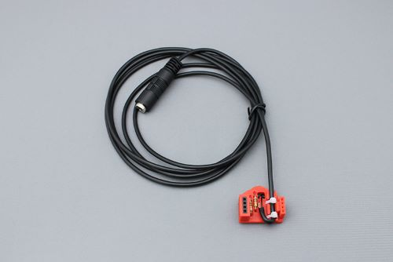

# LipSync Switch Input Module

The LipSync Switch Input Module enables a user to use a [LipSync](https://www.makersmakingchange.com/project/lipsync/) with two assistive switches instead of the standard Sip and Puff mouthpiece. This can be a helpful adaptation for anyone who has difficulty forming their lips around the mouthpiece or generating the typical sips and puffs.

## More info at
  - [Makers Making Change Project Page](https://www.makersmakingchange.com/project/lipsync-switch-input-module/)

## Getting Started

### 1. Order the Off-The-Shelf Components

The [Bill of Materials](/Documentation/Switch_Input_Module_BOM_v1.0.xlsx) lists all of the parts and components required to build the Simple Switch Tester. The electronic components may be available locally, but will probably need to be ordered online. Make sure you order the correct splitter.

### 2. Print the 3D Printed Circuit Board

Print the 3D Printed Circuit Board. The [file](/Build_Files/3D_Printing_Files/Switch_Input_3DPCB.stl) is in the [/Build_Files/3D_Printing_Files](/Build_Files/3D_Printing/) folder.

### 3. Disassemble the LipSync, Assemble and Install the Module, and Reassemble the LipSync 

Reference the [assembly guide](/Documentation/Switch_Input_Module_Assembly_Guide_v1.0.pdf) for the tools and steps required to complete each portion.

### 4. Attach an appropriate splitter and two suitable assistive switches.

Attach two momentary assistive switches.

## Files

### Documentation
| Document             | Version | Link                                                                                  |
|----------------------|---------|---------------------------------------------------------------------------------------|
| Design Rationale     | 1.0     | [Design_Rationale](/Documentation/Switch_Input_Module_v1.0.pdf) |
| Bill of Materials    | 1.0     | [BOM](/Documentation/Switch_Input_Module_BOM_v1.0.xlsx)                          |
| Assembly Guide       | 1.0     | [Assembly Guide](/Documentation/Switch_Input_Module_Assembly_Guide_v1.0.pdf)       |
| Quality Check Guide  | 1.0     | [Assembly Guide](/Documentation/Switch_Input_Module_Quality_Check_Guide_v1.0.pdf)       |
| User Quick Guide     | 1.0     | [Quick_Guide](/Documentation/Switch_Input_Module_User_Quick_Guide_v1.0.pdf)           |

### Design Files
 - [CAD Files](/Design_Files)

### Build Files
 - [3D Printing Files](/Build_Files/3D_Printing)
 - [V1.0 STL](/Build_Files/3D_Printing_Files/Switch_Input_3DPCB.stl)

## License

Everything needed or used to design, make, test, or prepare the LipSync Switch Input Module is licensed under the CERN 2.0 Permissive license <https://ohwr.org/project/cernohl/wikis/Documents/CERN-OHL-version-2> (CERN-OHL-P) .

Accompanying material such as instruction manuals, videos, and other copyrightable works that are useful but not necessary to design, make, test, or prepare the LipSync Switch Input Module are published under a Creative Commons Attribution-ShareAlike 4.0 license <https://creativecommons.org/licenses/by-sa/4.0/> (CC BY-SA 4.0)

## About Makers Making Change

Makers Making Change is an initiative of [Neil Squire](https://www.neilsquire.ca/), a Canadian non-profit that helps people with disabilities.

We are committed to creating a network of volunteer makers who support people with disabilities in their communities through building cost-effective assistive devices. Check out our library of free, open-source assistive technologies with parts and build instructions.

 - [www.MakersMakingChange.com](https://www.makersmakingchange.com/)
 - [GitHub](https://github.com/makersmakingchange)
 - [Thingiverse](https://www.thingiverse.com/makersmakingchange/about)
 - Twitter: [@makermakechange](https://twitter.com/makermakechange)
 - Instagram: [@makersmakingchange](https://www.instagram.com/makersmakingchange)

### Contact Us

For technical questions, to get involved, or share your experience we encourage you to visit the [MMC Device Page]( https://www.makersmakingchange.com/project), [MMC Forum](https://forum.makersmakingchange.com), or contact info@makersmakingchange.com
